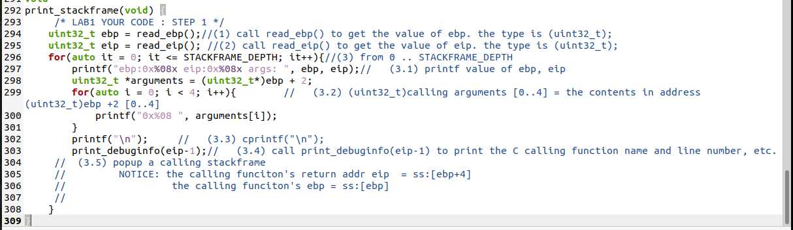
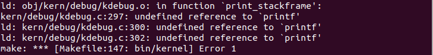
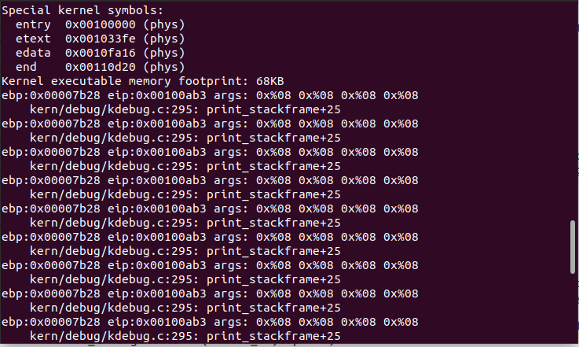
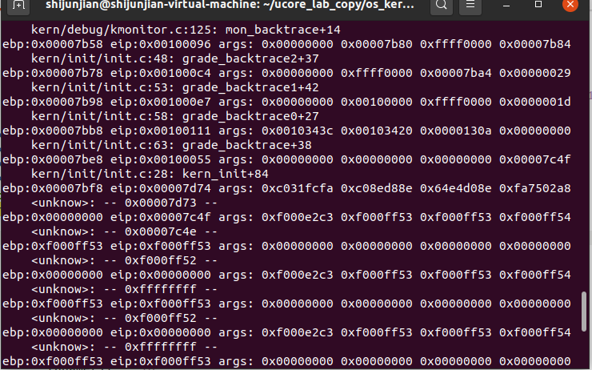
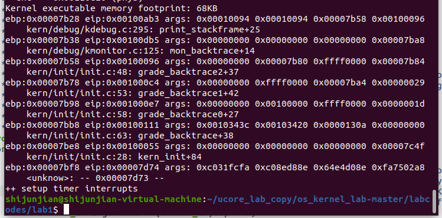
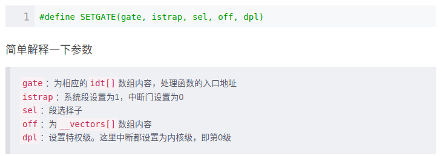
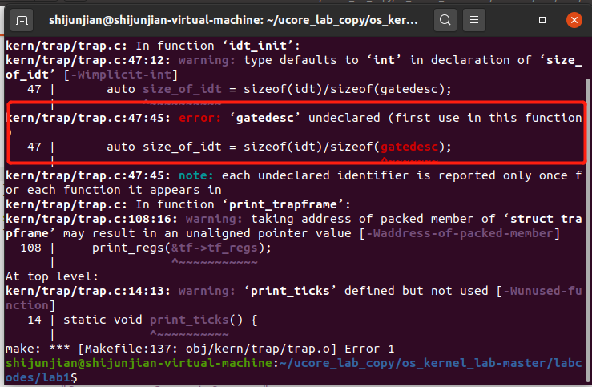

# lab1-report

## 实验五

实验5遇到的坑以及解决办法：

#### 1 没有定义的函数printf

改成注释中要求的cprintf

#### 2 忘记切换ebp与eip以及C语言格式化输出有误

发现ebp和eip每次输出的结果都是一样的，打印出的东西也发生了错误（C语言格式化输出错误）。忘记编码最后一步（ebp和eip的切换）

#### 3 忘记检查ebp边界，即是否为零检查

所以打印出一堆<unknow>的堆栈信息。应该在代码循环处加上ebp!=0的边界情况。

所以看出，加上边界检查之后一旦发现ebp为0就停止向下打印。

## 实验六

#### 中断向量表的初始化

对中断向量表的初始化根本没有头绪，仔细阅读了一下代码后面的注释与提示，实际上setgate函数的构造函数在另外一个头文件mmu.h里已经定义好了，而其中的一些参数在另一个头文件memlayout.h定义好了。就是往里面填上相应的表项：

（这是网上资料对SETGATE函数的解释）

#### 计算idt大小的问题，始终发现gatedesc需要定义

实际上这个也不能成为坑，只是怪自己C++没学好：这里是通过实例的大小除以这个结构体定义的大小来计算idt的大小，而结构体的大小是必须要指定struct的，否则会被识别为未定义标识符。

#### 时钟两种实现方式孰优孰劣？

(1) If(ticks==100) ticks-=100; print_ticks();

(2) if(ticks%100==0) print_ticks();

第二种模运算非常耗时（甚至比除法更甚），所以会造成时钟周期相较于100ms偏差更大。