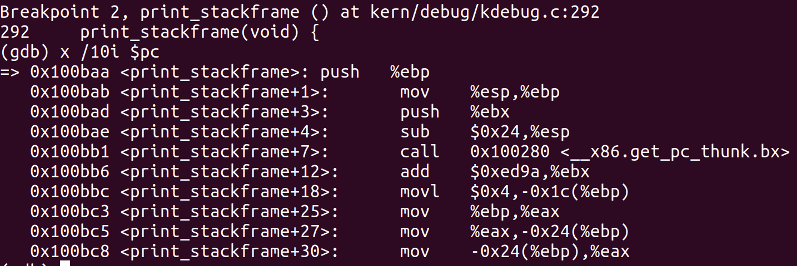

# lab1-report

## 练习1

#### 1 execvp: bin/sign: 权限不够

安装好gcc和qemu，执行make命令立刻出现了第一个问题：make之后执行到ld bin/bootblock就提示出错,，使用sudo也没有用：

```shell
+ ld bin/bootblock
make: execvp: bin/sign: 权限不够
Makefile:202: recipe for target 'bin/bootblock' failed
make: *** [bin/bootblock] Error 127
```

于是去查看了bin/sign的权限：


应当是执行权限的问题，但是需要勾选上允许可执行却发现选不上（会立刻取消）

查了好多博客没有类似情况，最后在一个论坛的评论里找到答案：原因是我将工作区放到了我的移动硬盘里，而需要移到ubuntu的/home工作区才能修改权限。

于是重新迁移工作区到/home目录，执行make，成功运行。输出如下：

```shell
+ cc kern/init/init.c
+ cc kern/libs/stdio.c
+ cc kern/libs/readline.c
+ cc kern/debug/panic.c
+ cc kern/debug/kdebug.c
+ cc kern/debug/kmonitor.c
+ cc kern/driver/clock.c
+ cc kern/driver/console.c
+ cc kern/driver/picirq.c
+ cc kern/driver/intr.c
+ cc kern/trap/trap.c
+ cc kern/trap/vectors.S
+ cc kern/trap/trapentry.S
+ cc kern/mm/pmm.c
+ cc libs/string.c
+ cc libs/printfmt.c
+ ld bin/kernel
# 执行链接脚本利用kobjs生成kernel对象
+ cc boot/bootasm.S
+ cc boot/bootmain.c
+ cc tools/sign.c
+ ld bin/bootblock
'obj/bootblock.out' size: 488 bytes
build 512 bytes boot sector: 'bin/bootblock' success!
记录了10000+0 的读入
记录了10000+0 的写出
5120000 bytes (5.1 MB, 4.9 MiB) copied, 0.0298493 s, 172 MB/s
记录了1+0 的读入
记录了1+0 的写出
512 bytes copied, 0.000176146 s, 2.9 MB/s
记录了155+1 的读入
记录了155+1 的写出
79840 bytes (80 kB, 78 KiB) copied, 0.000772137 s, 103 MB/s
```

#### 2 一个被系统认为是符合规范的硬盘主引导扇区的特征是什么?

这是练习里的问题，查看Makefile文件对应bootblock的部分如下：

```makefile
# create bootblock
bootfiles = $(call listf_cc,boot)
$(foreach f,$(bootfiles),$(call cc_compile,$(f),$(CC),$(CFLAGS) -Os -nostdinc))

bootblock = $(call totarget,bootblock)

$(bootblock): $(call toobj,$(bootfiles)) | $(call totarget,sign)
	@echo + ld $@
	$(V)$(LD) $(LDFLAGS) -N -e start -Ttext 0x7C00 $^ -o $(call toobj,bootblock)
	@$(OBJDUMP) -S $(call objfile,bootblock) > $(call asmfile,bootblock)
	@$(OBJDUMP) -t $(call objfile,bootblock) | $(SED) '1,/SYMBOL TABLE/d; s/ .* / /; /^$$/d' > $(call symfile,bootblock)
	@$(OBJCOPY) -S -O binary $(call objfile,bootblock) $(call outfile,bootblock)
	@$(call totarget,sign) $(call outfile,bootblock) $(bootblock)

$(call create_target,bootblock)
```

```@$(call totarget,sign) $(call outfile,bootblock) $(bootblock)```这里使用了sign工具重写文件，查看sign.c的代码：

```c
int main(int argc, char *argv[]) {
    struct stat st;
    if (argc != 3) {
        fprintf(stderr, "Usage: <input filename> <output filename>\n");
        return -1;
    }
    if (stat(argv[1], &st) != 0) {
        fprintf(stderr, "Error opening file '%s': %s\n", argv[1], strerror(errno));
        return -1;
    }
    printf("'%s' size: %lld bytes\n", argv[1], (long long)st.st_size);
    if (st.st_size > 510) {
        fprintf(stderr, "%lld >> 510!!\n", (long long)st.st_size);
        return -1;
    }
    char buf[512];
    memset(buf, 0, sizeof(buf));
    FILE *ifp = fopen(argv[1], "rb");
    int size = fread(buf, 1, st.st_size, ifp);
    if (size != st.st_size) {
        fprintf(stderr, "read '%s' error, size is %d.\n", argv[1], size);
        return -1;
    }
    fclose(ifp);
    buf[510] = 0x55;
    buf[511] = 0xAA;
    FILE *ofp = fopen(argv[2], "wb+");
    size = fwrite(buf, 1, 512, ofp);
    if (size != 512) {
        fprintf(stderr, "write '%s' error, size is %d.\n", argv[2], size);
        return -1;
    }
    fclose(ofp);
    printf("build 512 bytes boot sector: '%s' success!\n", argv[2]);
    return 0;
}
```

答案就很明确了，符合规范的硬盘主引导扇区的特征如下：

- 主引导扇区的长度为512个字节长
- ```buf[510] = 0x55;buf[511] = 0xAA;```——以0x55AA结尾

## 练习2

#### 1 qemu命令不存在

安装之后可以显示版本，却无法执行命令qemu


看到一篇博客上的方法——按q+tab查看可使用的命令：


使用命令qemu-system-i386就行,也可以建立软链接以使用qemu。

```
qemu-system-i386 -s -S -hda ./bin/ucore.img -monitor stdio -D qemu.log
```

#### 2 简要说明运行过程

执行qemu，将ucore暂停住
```
qemu-system-i386 -s -S -hda ./bin/ucore.img -monitor stdio -D qemu.log
```

开另一个终端，运行gdb，运行以下命令调试

```
set architecture i8086
target remote localhost:1234
file ./bin/kernel     #为了让gdb在调试的过程中获取到符号信息
b *0x7c00            #对地址c进行断点设置的方法
c            #continue
x /10i $pc 			#查看反汇编代码
si               #以机器代码的形式单步调试
```
运行到0x7c00如下图：


这时```x /10i $pc```查看之后的反汇编代码：

```asm
=> 0x7c00:	cli    
   0x7c01:	cld    
   0x7c02:	xor    %eax,%eax
   0x7c04:	mov    %eax,%ds
   0x7c06:	mov    %eax,%es
   0x7c08:	mov    %eax,%ss
   0x7c0a:	in     $0x64,%al
   0x7c0c:	test   $0x2,%al
   0x7c0e:	jne    0x7c0a
   0x7c10:	mov    $0xd1,%al
```
对比bootasm.S：


bootblock.asm：


在kernel.asm中找到print_stackframe

```assembly
void
print_stackframe(void) {
  100baa:	55                   	push   %ebp
  100bab:	89 e5                	mov    %esp,%ebp
  100bad:	53                   	push   %ebx
  100bae:	83 ec 24             	sub    $0x24,%esp
  100bb1:	e8 ca f6 ff ff       	call   100280 <__x86.get_pc_thunk.bx>
  100bb6:	81 c3 9a ed 00 00    	add    $0xed9a,%ebx
      *                   the calling funciton's ebp = ss:[ebp]
      */
	//print the important info of register ebp and esp
	uint32_t ebp_value;	//the value is the address of ebp register
	uint32_t eip_value;
	uint32_t argu_count = 4;
  100bbc:	c7 45 e4 04 00 00 00 	movl   $0x4,-0x1c(%ebp)
}
```

设置断点到  0x100baa，输入c继续运行，可以查看到print_stackframe的汇编代码




## 练习3 如何使能和进入保护模式以及GDT全局描述符表

```assembly
#include <asm.h>

# 启动CPU:切换到32位保护模式，跳转到C
# BIOS将这段代码从硬盘的第一个扇区加载到物理地址0x7c00的内存中，并以%cs= 0% ip=7c00的实际模式开始执行。

.set PROT_MODE_CSEG,        0x8                     # 核心代码段选择器
.set PROT_MODE_DSEG,        0x10                    # 核心数据段选择器
.set CR0_PE_ON,             0x1                     # 保护模式启用标志

# 开始地址应该是0:7c00，在实模式下，运行的引导汇编程序的开始地址
.globl start   #以下几步是关闭中断操作
start:
.code16                                             # 16位汇编模式
    cli                                             # cli 禁止中断发生
    cld                                             # 串操作指令，使得DF寄存器置零

    # 设置重要数据段寄存器(DS, ES, SS)
    xorw %ax, %ax                                   # ax寄存器清零
    movw %ax, %ds                                   # -> 数据段寄存器清零
    movw %ax, %es                                   # -> 附加段寄存器清零
    movw %ax, %ss                                   # -> 堆栈段清零

    # 启用A20:
#  为了向后兼容最早的pc，物理地址行20被绑定得很低，所以高于1MB的地址在默认情况下循环回零（我个人理解为取模）。这段代码解除了这个功能。
seta20.1:    #告诉CPU这一步将要向8042的P2端口写数据
inb $0x64, %al                                 
# inb 从I/O端口读取一个字节(BYTE, HALF-WORD) 
            # 读取状态寄存器，等待8042键盘控制器空闲
    testb $0x2, %al    #判断输入缓存是否为空
    jnz seta20.1

    movb $0xd1, %al                                 # 0xd1 -> port 0x64
outb %al, $0x64                                 
# outb指令是输出，向P2端口写入$0xdl

seta20.2:    #向端口0x60写数据0xdf，从而将A20置一
inb $0x64, %al                   # inb 从I/O端口读取一个字节(BYTE, HALF-WORD) 
              
testb $0x2, %al  # 读取状态寄存器，等待8042键盘控制器空闲

    jnz seta20.2

    movb $0xdf, %al                                 # 0xdf -> port 0x60
outb %al, $0x60                                 #通过0x60写入数据11011111 即将A20置1

# 从实模式切换到保护模式，使用引导GDT和段转换，使虚拟地址与物理地址相同，这样有效内存映射在切换期间不会改变。
实模式： cs：ip寻址模式 也就是cs乘以16（左移4位）+ip 最大寻址空间1M
保护模式： 保护模式与实模式相比，主要是两个差别：一是提供了段间的保护机 制，防止程序间胡乱访问地址带来的问题，二是访问的内存空间变大。
lgdt gdtdesc    #加载GDT表：全局描述表
    movl %cr0, %eax
    orl $CR0_PE_ON, %eax
    movl %eax, %cr0

    # Jump to next instruction, but in 32-bit code segment.
    # Switches processor into 32-bit mode.
    ljmp $PROT_MODE_CSEG, $protcseg

.code32                                             # Assemble for 32-bit mode
protcseg:
    # 设置保护模式的数据段寄存器
    movw $PROT_MODE_DSEG, %ax                       # Our data segment selector
    movw %ax, %ds                                   # -> DS: Data Segment
    movw %ax, %es                                   # -> ES: Extra Segment
    movw %ax, %fs                                   # -> FS
    movw %ax, %gs                                   # -> GS
    movw %ax, %ss                                   # -> SS: Stack Segment

# 设置堆栈指针并调用C 堆栈区域从0开始(0x7c00)   
movl $0x0, %ebp
    movl $start, %esp
    call bootmain

    # If bootmain returns (it shouldn't), loop.
spin:
    jmp spin

# Bootstrap GDT
.p2align 2                                          # force 4 byte alignment
gdt:
    SEG_NULLASM                                     # null seg
    SEG_ASM(STA_X|STA_R, 0x0, 0xffffffff)           # code seg for bootloader and kernel
    SEG_ASM(STA_W, 0x0, 0xffffffff)                 # data seg for bootloader and kernel
               #0x0-0xffffffff意味着每个段分配4G的长度
gdtdesc:
    .word 0x17                                      # sizeof(gdt) - 1
.long gdt                                       # address gdt

# 把全局描述符表的大小和起始地址共8个字节加载到全局描述符表寄存器GDTR中。从代码中可以看到全局描述符表的大小为0x17 + 1 = 0x18，也就是24字节。由于全局描述符表每项大小为8字节，因此一共有3项，而第一项是空白项，所以全局描述符表中只有两个有效的段描述符，分别对应代码段和数据段。
```
## 练习4 分析bootloader加载ELF格式

这里面没啥坑都是静态分析过程

## 练习5

#### 1 没有定义的函数printf


改成注释中要求的cprintf

#### 2 忘记切换ebp与eip以及C语言格式化输出有误


发现ebp和eip每次输出的结果都是一样的，打印出的东西也发生了错误（C语言格式化输出错误）。忘记编码最后一步（ebp和eip的切换）

#### 3 忘记检查ebp边界，即是否为零检查


所以打印出一堆<unknow>的堆栈信息。应该在代码循环处加上ebp!=0的边界情况。


所以看出，加上边界检查之后一旦发现ebp为0就停止向下打印。

## 练习6

#### 1 中断向量表的初始化

对中断向量表的初始化根本没有头绪，仔细阅读了一下代码后面的注释与提示，实际上setgate函数的构造函数在另外一个头文件mmu.h里已经定义好了，而其中的一些参数在另一个头文件memlayout.h定义好了。就是往里面填上相应的表项：

（这是网上资料对SETGATE函数的解释）


#### 2 计算idt大小的问题，始终发现gatedesc需要定义


实际上这个也不能成为坑，只是怪自己C++没学好：这里是通过实例的大小除以这个结构体定义的大小来计算idt的大小，而结构体的大小是必须要指定struct的，否则会被识别为未定义标识符。

#### 3 时钟两种实现方式孰优孰劣？

(1) If(ticks==100) ticks-=100; print_ticks();

(2) if(ticks%100==0) print_ticks();

第二种模运算非常耗时（甚至比除法更甚），所以会造成时钟周期相较于100ms偏差更大。
