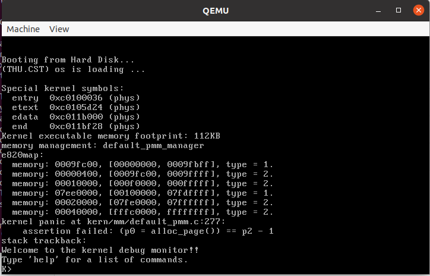
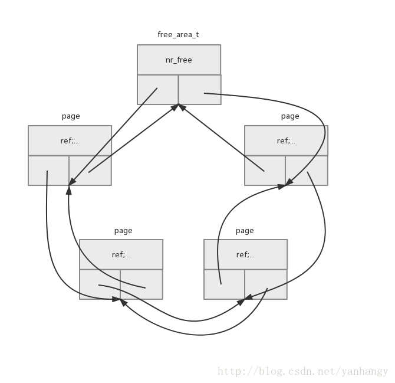
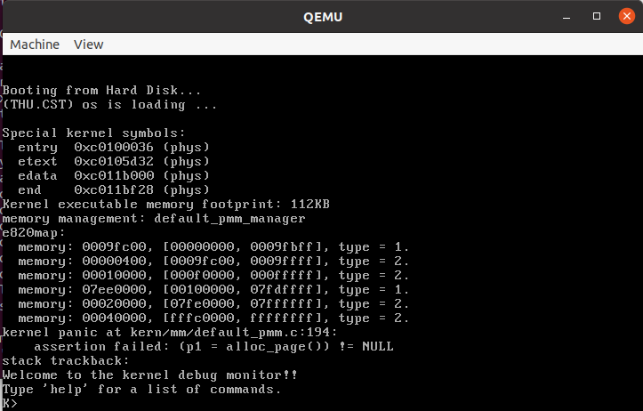
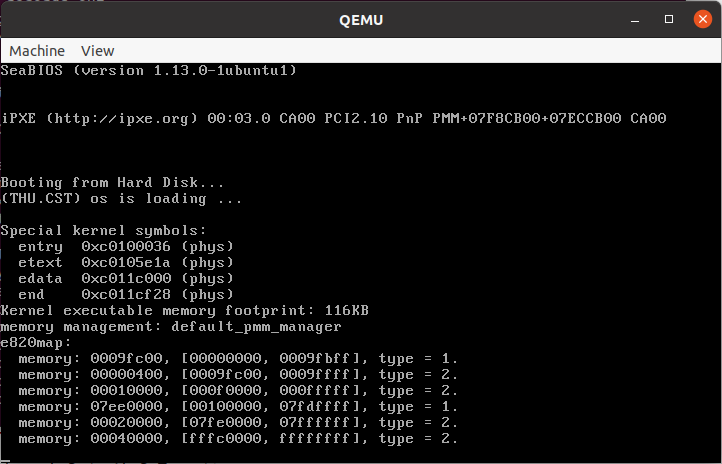
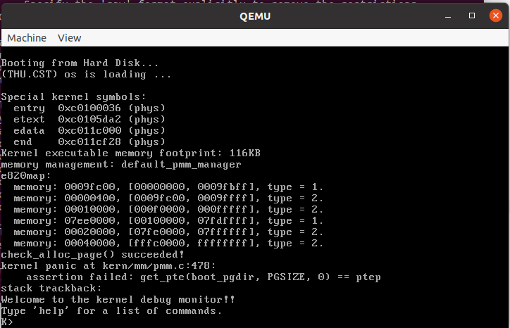
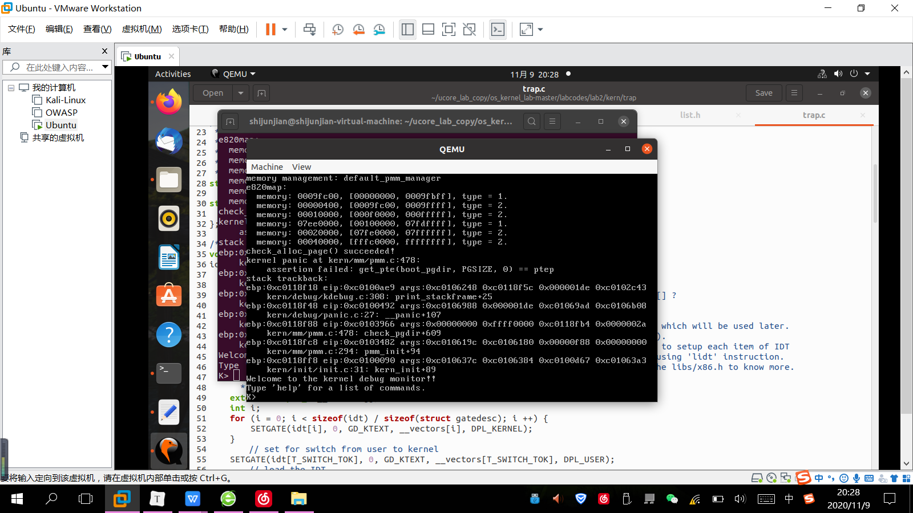

<center><font size=8 face="楷体">操作系统 Lab2 实验报告</font></center>

<center><font face="楷体">小组成员：</font></center>
<center><font face="楷体">1811398 鲁含章</font></center>
<center><font face="楷体">1811419 施君鉴</font></center>
<center><font face="楷体">1813670 左环语</font></center>

<center><font face="楷体">日期：2020年11月11日</font></center>


## 目录

[TOC]

## 第一部分 前期准备

### 1.1 系统内存的探测方法

在分配物理内存之前，操作系统必须要知道哪些物理内存是可以使用的，哪些物理内存是不可以使用的。如何知道物理内存可用与否，就需要通过某种机制来对物理内存地址进行一个探测：这里使用向INT 15h BIOS中断传递一个e820h参数来探测。这个方法是如何进行的？首先需要分析物理内存探查方法：打开ucore的bootasm.S文件找到物理内存探查的汇编代码：

```assembly
probe_memory:
//对 0x8000 处的 32 位单元清零,即给位于 0x8000 处的
//struct e820map 的结构域 nr_map 清零
movl $0, 0x8000
xorl %ebx, %ebx
//表示设置调用 INT 15h BIOS 中断后,BIOS 返回的映射地址描述符的起始地址
movw $0x8004, %di
start_probe:
movl $0xE820, %eax // INT 15 的中断调用参数
//设置地址范围描述符的大小为 20 字节,其大小等于 struct e820map 的结构域 map 的大
小
movl $20, %ecx
//设置 edx 为 534D4150h (即 4 个 ASCII 字符“SMAP”),这是一个约定
movl $SMAP, %edx
//调用 int 0x15 中断,要求 BIOS 返回一个用地址范围描述符表示的内存段信息
int $0x15
//如果 eflags 的 CF 位为 0,则表示还有内存段需要探测
jnc cont
//探测有问题,结束探测
movw $12345, 0x8000
jmp finish_probe
cont:
//设置下一个 BIOS 返回的映射地址描述符的起始地址
addw $20, %di
//递增 struct e820map 的结构域 nr_map
incl 0x8000
//如果 INT0x15 返回的 ebx 为零,表示探测结束,否则继续探测
cmpl $0, %ebx
jnz start_prob8e
finish_probe :
```

## 第二部分 编码过程

### 2.1 直接make qemu

查看需要编码的文件，发现每个函数都已经编好了，所以直接输入**make qemu**进行测试，发现断言失败。



由于最初实现的代码只是简单地将pages插入到链表中，也没有指定插入到哪个合适的位置，所以allocate了几次之后就乱套了，造成断言失败（从图中看得出来还是分配了几次的）


### 2.2 编码中遇到的困难

这个函数为从空闲链表中申请n个空闲页，如果成功，返回第一个页表的地址。这个函数会遍历空闲链表，一旦发现有大于等于n的连续空闲页块，便循环的将n个页从空闲页链表中取出，同时使用SetPageReserved和ClearPageProperty表示该页为使用状态，同时如果该连续页的数目大于n，则从第n+1开始截断，之后为截断的块，重新计算相应的property的值。




改写完成之后继续**make qemu**，发现assert断言在另一个地方死掉了：



编码完成之后，ucore宕机了，具体报错如下：



对le做了修改之后，发现assert又死在了一个新的地方：



但是发现check_alloc_page()成功了！为什么没有打印stack trackback的结构信息：原来我忘记将lab1的代码粘进去了。这说明lab2的编码工作是正确的：



#### 2.2.1 练习1：实现 first-fit 连续物理内存分配算法（需要编程）

1. init：对物理内存管理器的初始化
首先查看default_init中的内容，发现仅有对空闲内存块链表的初始化以及将总空闲数目置零的操作，这是与具体物理内存分配算法无关的，因此直接使用默认的函数实现即可； 
```C
list_init(&free_list);     
nr_free = 0;
```
2. init_memmap：对管理的空闲页的数据进行初始化；
该函数的具体作用为对最初的一整块未被占用的物理内存空间中的每一页所对应的Page结构（用于描述这些页的状态）进行初始化，考虑到相邻的物理页对应的Page结构在内存上也是同样相邻的，因此可以直接通过第一个空闲物理页对应的Page结构加上一个偏移量的方式来访问所有的空闲的物理页的Page结构，具体初始化方式为：
遍历所有空闲物理页的Page结构，将Page结构的描述空闲块的数目的成员变量置零（因此该成员变量只有在整个空闲块的第一个Page中才有意义），然后清空这些物理页的引用计数，然后通过设置flags的位的方式将其标记为空闲:
```C
struct Page *p = base;
for (; p != base + n; p ++) {
    assert(PageReserved(p));
    p->flags = p->property = 0;
    set_page_ref(p, 0);
    SetPageProperty(p);
}
```
接下来对空闲块的第一个页的Page结构进行初始化，具体实现为将其表示空闲块大小的成员变量设置为作为参数传入的空闲块大小（单位为页），然后更新存储所有空闲页数量的全局变量，然后将这个空闲块插入到空闲内存块链表中（只需要将第一个Page的page_link插入即可）;
```C
base->property = n;
nr_free += n;
list_add(&free_list, &(base->page_link));
```
3. alloc_pages：申请分配指定数量的物理页；
该函数的具体功能为分配指定页数的连续空闲物理空间，并且将第一页的Page结构的指针作为结果返回；该函数的具体实现方式如下：
对参数进行合法性检查，并且查询总的空闲物理页数目是否足够进行分配，如果不足够进行分配，直接返回NULL，表示分配失败；
从头开始遍历保存空闲物理内存块的链表(按照物理地址的从小到大顺序)，如果找到某一个连续内存块的大小不小于当前需要的连续内存块大小，则说明可以进行成功分配（选择第一个遇到的满足条件的空闲内存块来完成内存分配）
```C
struct Page *page = NULL;
list_entry_t *le = &free_list;
while ((le = list_next(le)) != &free_list) {
    struct Page *p = le2page(le, page_link);
    if (p->property >= n) {
        page = p;
        break;
    }
}
```
接下来考虑对获得的满足条件的空闲内存块进行处理，如果该内存块的大小大于需要的内存大小，则将空闲内存块分裂成两块，物理地址较小的一块分配出来进行使用（大小恰好为需要的物理内存的大小），而物理地址较大的那一块重新进行初始化（包括对第一个Page中表示空闲块大小的成员变量进行设置，其应当设置为原先的空闲块大小减掉分配掉的大小，以及将这个分裂出来的空闲块插入到空闲块链表中（该链表中的空闲块按照物理地址从小到大排序））；如果原先的空闲块大小刚好等于需要的内存大小，则没有比较进行分裂；于此同时，对分配出去的物理内存的每一个的描述信息（即对应的Page结构）进行初始化，具体为修改flags成员变量来将这些Page标记为非空闲，最后将原始空闲块在空闲块链表中删除掉，并且更新表示总空闲页数量的全局变量；最后用于表示分配到的物理内存的Page结构指针返回。
```C
if (page != NULL) { // 如果寻找到了满足条件的空闲内存块
    for (struct Page *p = page; p != (page + n); ++p) {
        ClearPageProperty(p); // 将分配出去的内存页标记为非空闲
    }
    if (page->property > n) { // 如果原先找到的空闲块大小大于需要的分配内存大小，进行分裂
        struct Page *p = page + n; // 获得分裂出来的新的小空闲块的第一个页的描述信息
        p->property = page->property - n; // 更新新的空闲块的大小信息
        list_add(&(page->page_link), &(p->page_link)); // 将新空闲块插入空闲块列表中
    }
    list_del(&(page->page_link)); // 删除空闲链表中的原先的空闲块
    nr_free -= n; // 更新总空闲物理页的数量
}

```
4. free_pages: 申请释放若干指定物理页
该函数的具体功能为释放指定的某一物理页开始的若干个连续物理页，并且完成first-fit算法中需要的若干信息的维护，具体的实现如下所示：
首先考虑遍历需要释放的物理页的描述信息（即对应的Page结构），对其进行更新，具体内容为：
判断原先这些物理页是否真的被占用了，如果释放未被占用的物理页，这说明出现了异常情况；
设置flags来将这些物理页标记为空闲；
清空这些物理页的引用计数；
5. nr_free_pages：查询当前的空闲页总数；


#### 2.2.2 练习2

##### 1. 关于控制寄存器CR0~3

他们具体的功能在做之初老搞不清楚，查阅记录如下

> **CR0**：包含了6个预定义标志，0位是保护允许位PE(Protedted Enable)，用于启动保护模式，如果PE位置1，则保护模式启动，如果PE=0，则在实模式下运行。1位是监控协处理位MP(Moniter coprocessor)，它与第3位一起决定：当TS=1时操作码WAIT是否产生一个“协处理器不能使用”的出错信号。第3位是任务转换位(Task Switch)，当一个任务转换完成之后，自动将它置1。随着TS=1，就不能使用协处理器。CR0的第2位是模拟协处理器位 EM (Emulate coprocessor)，如果EM=1，则不能使用协处理器，如果EM=0，则允许使用协处理器。第4位是微处理器的扩展类型位ET(Processor Extension Type)，其内保存着处理器扩展类型的信息，如果ET=0，则标识系统使用的是287协处理器，如果 ET=1，则表示系统使用的是387浮点协处理器。CR0的第31位是分页允许位(Paging Enable)，它表示芯片上的分页部件是否允许工作。

> **CR1**：未定义的控制寄存器，供将来的处理器使用。

> **CR2**：页故障线性地址寄存器，保存最后一次出现页故障的全32位线性地址。

> **CR3**：页目录基址寄存器，保存页目录表的物理地址，页目录表总是放在以4K字节为单位的存储器边界上，因此，它的地址的低12位总为0，不起作用，即使写上内容，也不会被理会。

##### 2. 关于u_core中的段式管理

开始看代码很疑惑变量va虚拟地址和la线性地址的区别，在80386里两者是不同的，而代码里似乎不是这样。翻阅指导书得到如下解答，所以u_core没有完整的段式管理。

>段式管理前一个实验已经讨论过。在 ucore 中段式管理只起到了一个过渡作用,它将逻辑地
>址不加转换直接映射成线性地址,所以我们在下面的讨论中可以对这两个地址不加区分(目
>前的 OS 实现也是不加区分的)。

##### 3. 如果ucore执行过程中访问内存,出现了页访问异常,请问硬件要做哪些事情?

这里问的是硬件，代码里就找不到了，查阅出现页访问异常会触发缺页中断,缺页中断发生时的事件顺序如下：

1. 硬件陷入内核,在内核堆栈中保存程序计数器。大多数机器将当前指令的各种状态信息保存在特殊的
   CPU寄存器中;
2. 启动一个汇编代码例程保存通用寄存器和其他易失的信息,以免被操作系统破坏;
3. 当操作系统发现一个缺页中断时,尝试发现需要哪个虚拟页面。通常一个硬件寄存器包含了这一信息,如果没有的话,操作系统必须检索程序计数器,取岀这条指令,用软件分析这条指令,看看它在缺页中断时正在做什么;
4. 一旦知道了发生缺页中断的虚拟地址,操作系统检査这个地址是否有效,并检査存取与保护是否一致如果不一致,向进程发岀一个信号或杀掉该进程。如果地址有效且没有保护错误发生,系统则检查是否有闲页框。如果没有空闲页框,执行页面置换算法寻找一个页面来淘汰;
5. 如果选择的页框“脏”了,安排该页写回磁盘,并发生一次上下文切换,挂起产生缺页中断的进程,让其他进程运行直至磁盘传输结東。无论如何,该页框被标记为忙,以免因为其他原因而被其他进程占用;
6. 一旦页框“干净”后(无论是立刻还是在写回磁盘后),操作系统查找所需页面在磁盘上的地址,通过磁盘操作将其装入。该页面被装入后,产生缺页中断的进程仍然被挂起,并且如果有其他可运行的用户进程则选择另一个用户进程运行；
7. 当磁盘中断发生时,表明该页已经被装入,页表已经更新可以反映它的位置,页框也被标记为正常状态；
8. 恢复发生缺页中断指令以前的状态,程序计数器重新指向这条指令；
9. 调度引发缺页中断的进程,操作系统返回调用它的汇编语言；
   1. 该例程恢复寄存器和其他状态信息。

#### 2.2.3 练习3
```C
assert(*ptep & PTE_P); // 确保传入的二级页表项是存在的
struct Page *page = pte2page(*ptep); // 获取该页表项对应的物理页对应的Page结构
page->ref --; // 减少该物理页的引用计数
if (!page->ref) free_page(page); // 如果该物理页的引用计数变成0，即不存在任何虚拟页指向该物理页，释放该物理页
*ptep &= (~PTE_P); // 将PTE的存在位设置为0，表示该映射关系无效
tlb_invalidate(pgdir, la); // 刷新TLB，保证TLB中的缓存不会有错误的映射关系
```
练习3比较简单，就解答一下指导书里的问题：

##### 1. 数据结构Page的全局变量（其实是一个数组）的每一项与页表中的页目录项和页表项有无对应关系？如果有，其对应关系是啥？

- 是有存在对应关系：由于页表项中存放着对应的物理页的物理地址，因此可以通过这个物理地址来获取到对应到的Page数组的对应项，具体做法为将物理地址除以一个页的大小，然后乘上一个Page结构的大小获得偏移量，使用偏移量加上Page数组的基地址皆可以或得到对应Page项的地址； 

##### 2. 如果希望虚拟地址与物理地址相等，则需要如何修改lab2，完成此事？ 

- 我们只需将virt addr = linear addr = phy addr + 0xC0000000 转化改为virt addr = linear addr = phy addr + 0即使得虚拟地址与物理地址相等。

##### 3. 为什么将后12bit都置为0就可以获取到该pte中存储的物理页的地址值了呢？

- 这是因为存储在pte中到的物理地址页的后12bit其实都是为0的，因为我们存储的时候是根据一个页一个页去存储的，那么每个页的起始地址肯定是4096的整数倍，这样每个页的起始地址的后12bit肯定就是都为0的，因此就可以通过`& ~0xfff`的方法获取到一个pte中存储的物理地址页的起始地址

